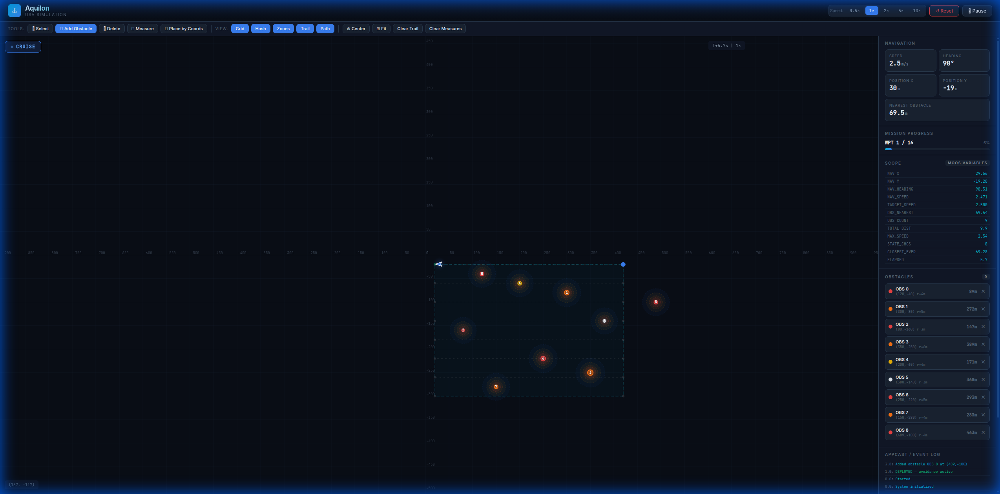

# ⚓ Aquilon — MOOS-ROS 2 Bridge & USV Obstacle Avoidance Simulation

**Aquilon** is a bidirectional bridge between [MOOS-IvP](https://oceanai.mit.edu/moos-ivp/) and [ROS 2 Jazzy](https://docs.ros.org/en/jazzy/), paired with a **browser-based USV (Unmanned Surface Vehicle) obstacle avoidance simulation** that runs entirely as static HTML/CSS/JS — deployable straight to [GitHub Pages](https://pages.github.com/) with zero dependencies.

> **🌐 Live Demo**: [https://amandeep-tridel.github.io/Aquilon-/](https://amandeep-tridel.github.io/Aquilon-/)



---

## Table of Contents

- [Overview](#overview)
- [Architecture](#architecture)
- [Browser-Based Simulation (GitHub Pages)](#browser-based-simulation-github-pages)
  - [Features](#features)
  - [User Interface Layout](#user-interface-layout)
  - [Toolbar Reference](#toolbar-reference)
  - [Keyboard Shortcuts](#keyboard-shortcuts)
  - [Interactive Obstacle Management](#interactive-obstacle-management)
  - [Simulation Engine](#simulation-engine)
  - [Obstacle Avoidance Algorithm](#obstacle-avoidance-algorithm)
  - [PID Controllers](#pid-controllers)
  - [Speed State Machine](#speed-state-machine)
  - [Threat Analysis & CPA Prediction](#threat-analysis--cpa-prediction)
  - [Collision Prevention](#collision-prevention)
  - [Rendering Pipeline](#rendering-pipeline)
  - [Scope (MOOS Variable Watch)](#scope-moos-variable-watch)
  - [Coordinate System](#coordinate-system)
- [MOOS-ROS 2 Bridge](#moos-ros-2-bridge)
  - [Bridge Design](#bridge-design)
  - [Configuration (YAML)](#configuration-yaml)
  - [ROS 2 Topics](#ros-2-topics)
- [Fake GPS Simulation Node (Python)](#fake-gps-simulation-node-python)
- [Prerequisites](#prerequisites)
- [Build & Run](#build--run)
- [File Structure](#file-structure)
- [License](#license)

---

## Overview

Aquilon consists of three major components:

| Component | Language | Purpose |
|-----------|----------|---------|
| **Browser Simulation** (`docs/`) | HTML/CSS/JS | Standalone interactive USV sim with obstacle avoidance — runs on GitHub Pages |
| **MOOS-ROS 2 Bridge** (`src/moos_ros2_bridge/`) | C++ | Bidirectional variable/topic forwarding between MOOSDB and ROS 2 |
| **Fake GPS Node** (`src/fake_gps/`) | Python | ROS 2 node simulating USV navigation with 8 static obstacles |

---

## Architecture

```
┌─────────────────────────────────────────────────────────────┐
│                    MOOS-IvP Layer                           │
│  pMarineViewer ←── MOOSDB ←── pNodeReporter                │
│       ▲                ▲                                    │
│       │                │                                    │
│       └────────────────┤                                    │
│                        │                                    │
├────────────────────────┼────────────────────────────────────┤
│                        │                                    │
│              moos_ros2_bridge (C++)                         │
│              CMOOSCommClient + rclcpp                       │
│                        │                                    │
├────────────────────────┼────────────────────────────────────┤
│                    ROS 2 Layer                              │
│                        │                                    │
│         fake_gps_with_obstacles.py                          │
│         (60 Hz sim → /gps/x, /gps/y, /view_marker)         │
│                                                             │
├─────────────────────────────────────────────────────────────┤
│              Browser Simulation (docs/)                     │
│              Standalone JS — no backend needed              │
│              Full algorithm ported from Python              │
└─────────────────────────────────────────────────────────────┘
```

---

## Browser-Based Simulation (GitHub Pages)

The browser simulation is a **complete port** of the Python obstacle avoidance algorithm into vanilla JavaScript. It runs at **60 fps** in any modern browser — no server, no dependencies, no build step.

**Files:**
| File | Size | Purpose |
|------|------|---------|
| `docs/index.html` | ~5 KB | Page structure: header, toolbar, canvas, sidebar, modal |
| `docs/style.css` | ~8 KB | Dark premium theme, glassmorphism, animations |
| `docs/app.js` | ~18 KB | Simulation engine, rendering, UI, event handlers |

### Features

#### pMarineViewer-Equivalent Features
| pMarineViewer Feature | Aquilon Equivalent | Details |
|----------------------|-------------------|---------|
| Vehicle display | Canvas USV triangle | Color-coded by speed state, glow effect |
| Vehicle trail | Color-coded trail | Trail color = speed state (red/orange/yellow/green/blue) |
| Grid overlay | Adaptive grid | Auto-scales grid spacing based on zoom level |
| Hash marks | Coordinate labels | X/Y axis values at grid intersections |
| Scope | Scope panel | 12 real-time MOOS-style variables |
| AppCast | Event log | State transitions, waypoint arrivals, obstacle events |
| Polygon rendering | Obstacle zones | 4 concentric detection rings per obstacle |
| Pan/Zoom | Mouse controls | Scroll=zoom, Shift+drag=pan, DblClick=center |
| Vehicle info | Stats panel | Speed, heading, position, nearest obstacle |

#### Additional Features (Beyond pMarineViewer)
- **Interactive obstacle add/delete/drag** — not possible in pMarineViewer
- **Measurement tool** — click two points, persistent measurements
- **Speed control** — 0.5× to 10× simulation speed
- **Place-by-coordinates modal** — exact obstacle positioning
- **Mission progress bar** — visual waypoint tracking
- **Keyboard shortcuts** — full keyboard control
- **Responsive layout** — works on any screen size

---

### User Interface Layout

```
┌──────────────────────────────────────────────────────────────┐
│  ⚓ Aquilon        [Speed: 0.5x 1x 2x 5x 10x]  [Reset][▶]  │  ← Header
├──────────────────────────────────────────────────────────────┤
│  Tools: [Select][Add][Delete][Measure][Coords]  View: [...]  │  ← Toolbar
├────────────────────────────────────────┬─────────────────────┤
│                                        │ NAVIGATION          │
│                                        │  Speed: 2.5 m/s     │
│            Canvas                      │  Heading: 90°       │
│        (Simulation View)               │  Pos: (120, -60)    │
│                                        │  Nearest: 14.2m     │
│  [● CRUISE]                            ├─────────────────────┤
│                                        │ MISSION PROGRESS     │
│        ◁ USV                           │  WPT 5/16  31%      │
│        ~~~trail~~~                     │  ████████░░░░░░░    │
│                                        ├─────────────────────┤
│     ⬤ OBS 0    ⬤ OBS 1               │ SCOPE                │
│       (detection rings)                │  NAV_X: 120.45      │
│                                        │  NAV_Y: -60.22      │
│                                        │  NAV_HEADING: 90.1  │
│                                        │  ...12 variables     │
│                                        ├─────────────────────┤
│  (127, -84)            T+45.2s | 2×    │ OBSTACLES      [8]  │
│                                        │  OBS 0 (120,-40) 14m│
│                                        │  OBS 1 (300,-80) 92m│
│                                        ├─────────────────────┤
│                                        │ EVENT LOG            │
│                                        │ 43.1s CRUISE → SLOW │
│                                        │ 40.0s WPT 5/16      │
└────────────────────────────────────────┴─────────────────────┘
```

---

### Toolbar Reference

#### Tool Modes

| Button | Key | Cursor | Action |
|--------|-----|--------|--------|
| 🖱 **Select** | `1` | Default | Click obstacles to select, drag to reposition, click empty space to pan |
| ➕ **Add Obstacle** | `2` | Cell (+) | Click anywhere on canvas to place a new obstacle (radius 4m, red) |
| 🗑 **Delete** | `3` | Not-allowed | Click any obstacle to permanently remove it |
| 📏 **Measure** | `4` | Crosshair | Click point A, then point B — distance is displayed and saved |
| 📌 **Place by Coords** | — | — | Opens modal dialog for exact X, Y, radius, and color input |

#### View Toggles

| Button | Default | What It Controls |
|--------|---------|-----------------|
| **Grid** | ✅ On | Background coordinate grid lines |
| **Hash** | ✅ On | Numeric coordinate labels at grid intersections |
| **Zones** | ✅ On | Concentric detection/flee/creep/slow rings around obstacles |
| **Trail** | ✅ On | Color-coded path history behind the USV |
| **Path** | ✅ On | Planned lawnmower waypoint path (dashed line) |

#### Action Buttons

| Button | Key | Action |
|--------|-----|--------|
| **⊕ Center** | `C` | Snap camera to current USV position |
| **⊞ Fit** | — | Reset camera to show entire survey area |
| **Clear Trail** | — | Erase all trail history |
| **Clear Measures** | — | Remove all saved measurements |

---

### Keyboard Shortcuts

| Key | Action |
|-----|--------|
| `Space` | Start / Pause simulation |
| `R` | Reset simulation to initial state |
| `C` | Center camera on USV |
| `1` | Select tool (drag obstacles, pan) |
| `2` | Add obstacle tool |
| `3` | Delete obstacle tool |
| `4` | Measurement tool |
| `Delete` | Remove currently selected obstacle |
| `Escape` | Cancel current action, return to Select mode |
| `Scroll Wheel` | Zoom in / out (0.2× to 10×) |
| `Shift + Drag` | Pan the view |
| `Double-Click` | Center view on clicked point |

---

### Interactive Obstacle Management

#### Adding Obstacles

**Method 1 — Click on Canvas:**
1. Click **➕ Add Obstacle** in the toolbar (or press `2`)
2. Click anywhere on the canvas
3. A new obstacle appears with default radius (4m) and red color
4. Switch back to Select mode (`1`) to drag it

**Method 2 — Exact Coordinates:**
1. Click **📌 Place by Coords** in the toolbar
2. Fill in the modal dialog:
   - **X Position**: meters in local frame (survey area: 20–420)
   - **Y Position**: meters in local frame (survey area: -20 to -300)
   - **Radius**: 1–20 meters (collision zone size)
   - **Color**: Red, Orange, Yellow, White, Purple, or Cyan
3. Click **Add Obstacle**

#### Deleting Obstacles

**Method 1 — Delete Tool:**
1. Click **🗑 Delete** in the toolbar (or press `3`)
2. Click on any obstacle to remove it

**Method 2 — Sidebar:**
- Click the **✕** button next to any obstacle in the sidebar list

**Method 3 — Keyboard:**
1. In Select mode, click an obstacle to select it (white border appears)
2. Press `Delete` key

#### Moving Obstacles

1. Ensure you're in **Select mode** (press `1`)
2. Click and drag any obstacle to a new position
3. The simulation reacts in real-time to the new position

---

### Simulation Engine

The simulation runs at **60 Hz** (ticks per second) using `requestAnimationFrame`. Each frame:

```
┌─────────────────────────┐
│   requestAnimationFrame │
│         (16.7ms)        │
├─────────────────────────┤
│  1. Calculate delta time│
│  2. Scale by sim speed  │
│  3. Run N sim ticks     │ ← Sub-stepping at 1/60s each
│  4. Render frame        │
│  5. Update UI (every 6) │
└─────────────────────────┘
```

**Sub-stepping:** At higher simulation speeds (e.g., 10×), multiple physics ticks run per frame to maintain accuracy. Each tick is capped at `1/60` seconds regardless of sim speed.

---

### Obstacle Avoidance Algorithm

The avoidance system uses a **potential field approach** combined with **PID control** and **predictive threat analysis**.

#### Overview Flow (Per Tick)

```
┌──────────────┐     ┌──────────────┐     ┌──────────────┐
│  Analyze     │────▶│  Compute     │────▶│  Compute     │
│  Threats     │     │  Target      │     │  Desired     │
│  (CPA pred)  │     │  Speed       │     │  Heading     │
└──────────────┘     └──────────────┘     └──────────────┘
                                                │
                     ┌──────────────┐     ┌─────▼────────┐
                     │  Move USV    │◀────│  PID         │
                     │  (collision  │     │  Controllers │
                     │   check)     │     │  (hdg + spd) │
                     └──────────────┘     └──────────────┘
```

#### Step 1: Threat Analysis

For each obstacle, the system computes:

| Metric | Formula | Purpose |
|--------|---------|---------|
| **Distance** | `√((ox-ux)² + (oy-uy)²) - obstacle_radius` | Current distance to obstacle surface |
| **CPA Distance** | Closest Point of Approach using relative velocity | Predicted minimum future distance |
| **Time to CPA** | `t = -(d⃗ · v⃗_rel) / |v⃗_rel|²` (clamped 0–8s) | When the closest approach will occur |
| **Closing** | `d⃗ · v⃗_obs < 0` | Is the obstacle moving toward us? |

The **effective distance** is `min(current_distance, CPA_distance)` — the system reacts to whichever is more threatening.

#### Step 2: Repulsive Force Computation

For each obstacle within `DETECTION_RANGE` (25m), a repulsive force is computed:

```
Force Direction: Away from obstacle (unit vector from obs → USV)
Force Magnitude: Varies by zone (see table below)
```

| Zone | Distance | Force Strength | Description |
|------|----------|---------------|-------------|
| **Emergency** | < 3m (MIN_CLEARANCE) | 80 | Maximum repulsion, pure flee |
| **Flee** | < 6m | `40 × FLEE_RANGE / dist` | Strong inverse-distance repulsion |
| **Creep** | < 10m | `8 + 20 × frac²` | Quadratic ramp-up |
| **Slow** | < 16m | `2 + 6 × frac` | Linear ramp |
| **Detect** | < 25m | `0.5 + 1.5 × frac` | Gentle steering |

**Closing multiplier:** If an obstacle is actively approaching (closing = true), force strength is multiplied by **2.5×**.

#### Step 3: Heading Blending

The desired heading combines waypoint attraction and obstacle repulsion:

```
waypoint_vector = normalize(waypoint - position) × 10
repulsive_vector = Σ (obstacle_repulsive_forces)
blended = waypoint_vector + repulsive_vector
desired_heading = atan2(blended.x, blended.y)
```

**Emergency override:** If any obstacle is within `MIN_CLEARANCE` (3m), the waypoint vector is completely ignored — pure flee heading.

**Close-to-waypoint override:** When within 20m of the target waypoint, obstacle avoidance is disabled and the USV steers directly to the waypoint to prevent orbiting.

---

### PID Controllers

#### Heading PID

Controls the USV's turn rate to track the desired heading.

| Parameter | Value | Purpose |
|-----------|-------|---------|
| Kp | 5.0 | Proportional gain — turn proportional to heading error |
| Ki | 0.05 | Integral gain — eliminates steady-state heading offset |
| Kd | 2.0 | Derivative gain — damps oscillations, prevents overshoot |
| Max Integral | 20.0 | Anti-windup clamp on integral term |
| Max Turn Rate | 120°/s | Physical turn rate limit (doubled to 240°/s in FLEE) |

**PID output flow:**
```
error = angleDiff(desired_heading, current_heading)  // -180° to +180°
pid_output = Kp×error + Ki×∫error + Kd×(Δerror/Δt)
turn = clamp(pid_output × dt, -max_turn_rate × dt, +max_turn_rate × dt)
heading += turn
```

The PID is **reset** when a waypoint is captured to prevent integral windup from carrying over between legs.

#### Speed PID

Controls acceleration/deceleration to track the target speed.

| Parameter | Value | Purpose |
|-----------|-------|---------|
| Kp | 3.0 | Tracks target speed |
| Kd | 0.8 | Smooth speed transitions |
| Max Accel | 3.0 m/s² | Normal acceleration limit |
| Max Accel (Flee) | 8.0 m/s² | Burst acceleration in emergency |
| Max Decel | 5.0 m/s² | Braking limit |

---

### Speed State Machine

The USV has **6 distinct speed states** with hysteresis to prevent oscillation:

```
                    ┌─────────┐
          ┌────────▶│  FAST   │◀── all clear > 5s
          │         │ 3.5 m/s │
          │         └────┬────┘
          │              │ obstacle detected
          │         ┌────▼────┐
          │    ┌───▶│ CRUISE  │◀── obstacle 16-25m
          │    │    │ 2.5 m/s │
          │    │    └────┬────┘
          │    │         │ closer
          │    │    ┌────▼────┐
          │    ├───▶│  SLOW   │◀── obstacle 10-16m
          │    │    │ 1.8 m/s │
          │    │    └────┬────┘
          │    │         │ closer
          │    │    ┌────▼────┐     ┌─────────┐
          │    ├───▶│ CREEP   │────▶│ EVADE   │◀── closing + < 10m
          │    │    │ 0.8 m/s │     │ dynamic │
          │    │    └────┬────┘     └─────────┘
          │    │         │ < 6m
          │    │    ┌────▼────┐
          │    └───▶│  FLEE   │◀── emergency escape
          │         │ 5.0 m/s │
          │         └────┬────┘
          │              │ clear
          └──────────────┘
```

**Hysteresis:** Each zone boundary has a **1.5m hysteresis band** — e.g., FLEE triggers at 6m but doesn't exit until 7.5m. This prevents rapid state oscillation near boundaries.

**EVADE state:** A special hybrid state triggered when an obstacle is within `CREEP_RANGE` (10m) AND closing. Speed scales with urgency:
```
urgency = 1 - (distance - FLEE_RANGE) / (CREEP_RANGE - FLEE_RANGE)
speed = CREEP_SPEED + (FAST_SPEED - CREEP_SPEED) × urgency
```

---

### Threat Analysis & CPA Prediction

The system uses **Closest Point of Approach (CPA)** prediction to react to future collisions, not just current distance.

```
Given:
  d⃗ = obstacle_position - usv_position          (relative position)
  v⃗_rel = obstacle_velocity - usv_velocity      (relative velocity)

Time to CPA:
  t_cpa = -(d⃗ · v⃗_rel) / |v⃗_rel|²              (clamped to [0, 8] seconds)

CPA position:
  p⃗_cpa = d⃗ + v⃗_rel × t_cpa

CPA distance:
  dist_cpa = |p⃗_cpa| - obstacle_radius

Effective distance (used for all decisions):
  d_eff = min(current_distance, cpa_distance)
```

This means the USV reacts to an obstacle that will be close in 5 seconds even if it's currently far away.

---

### Collision Prevention

As a last-resort safety layer, after computing the desired movement:

1. **Primary check:** Move to new position; if any obstacle surface is within `MIN_CLEARANCE` (3m), the move is **blocked**.
2. **Alternative directions:** Try 6 alternate headings at half speed: ±90°, ±45°, ±135°. Take the first clear direction.
3. **Full block:** If all alternatives are blocked, the USV holds position (does not move).

---

### Rendering Pipeline

Each frame renders these layers (back to front):

| Layer | Z-Order | Description |
|-------|---------|-------------|
| Background | 0 | Dark fill (#0a0e17) |
| Grid | 1 | Adaptive coordinate grid with hash labels |
| Survey Area | 2 | Dashed cyan boundary (20,−20) to (420,−300) |
| Planned Path | 3 | Dashed white line connecting all 16 waypoints |
| Waypoint Dots | 4 | Green (visited), blue (current), gray (future) |
| Trail | 5 | Color-coded polyline (up to 8000 points) |
| Detection Zones | 6 | 4 concentric dashed rings per obstacle |
| Obstacle Glow | 7 | Radial gradient halo around each obstacle |
| Obstacle Body | 8 | Filled circle with border and ID label |
| Distance Labels | 9 | Distance text above nearby obstacles |
| USV Glow | 10 | State-colored radial gradient |
| USV Body | 11 | Oriented triangle with white border |
| Heading Line | 12 | Blue line showing travel direction |
| Measurements | 13 | Dashed cyan lines with distance labels |

**Trail coloring by state:**
| State | Trail Color |
|-------|------------|
| FLEE | Red (239, 68, 68) |
| EVADE | Orange (249, 115, 22) |
| CREEP | Amber (245, 158, 11) |
| SLOW | Yellow (234, 179, 8) |
| CRUISE | Gold (251, 191, 36) |
| FAST | Green (16, 185, 129) |

---

### Scope (MOOS Variable Watch)

The Scope panel displays 12 real-time variables matching the MOOS variable convention:

| Variable | Type | Description |
|----------|------|-------------|
| `NAV_X` | float | USV X position in meters |
| `NAV_Y` | float | USV Y position in meters |
| `NAV_HEADING` | float | Current heading (0–360°) |
| `NAV_SPEED` | float | Current speed (m/s) |
| `TARGET_SPEED` | float | Desired speed from state machine |
| `OBS_NEAREST` | float | Distance to nearest obstacle surface (m) |
| `OBS_COUNT` | int | Total number of obstacles |
| `TOTAL_DIST` | float | Cumulative distance traveled (m) |
| `MAX_SPEED` | float | Highest speed achieved this run |
| `STATE_CHGS` | int | Number of state transitions |
| `CLOSEST_EVER` | float | Minimum distance to any obstacle ever |
| `ELAPSED` | float | Simulation time in seconds |

---

### Coordinate System

The simulation uses a **local Cartesian frame** consistent with MOOS-IvP:

```
        North (+Y)
           ▲
           │
           │
West ◀─────┼─────▶ East (+X)
           │
           │
           ▼
        South (-Y)
```

| Parameter | Value |
|-----------|-------|
| Heading 0° | North (+Y) |
| Heading 90° | East (+X) |
| Heading 180° | South (-Y) |
| Heading 270° | West (-X) |
| Survey area | X: 20–420m, Y: -20 to -300m |
| Lawnmower lanes | 8 lanes, 40m spacing |
| Waypoints | 16 total (8 legs × 2 endpoints) |

**Camera auto-follow:** The camera smoothly tracks the USV with `lerp(cam, usv, 0.03)` — a 3% convergence rate per frame for smooth following without jarring jumps.

---

## MOOS-ROS 2 Bridge

### Bridge Design

The bridge node (`moos_ros2_bridge`) embeds a `CMOOSCommClient` inside a ROS 2 node:

```cpp
class MoosRos2Bridge : public rclcpp::Node {
    CMOOSCommClient moos_client_;   // Non-blocking MOOS client
    std::mutex moos_mutex_;          // Thread safety
    rclcpp::TimerBase timer_;        // Polls MOOS mail at 10 Hz
    // Subscribers for each ROS→MOOS mapping
    // Publishers for each MOOS→ROS mapping
};
```

**Why `CMOOSCommClient` instead of `CMOOSApp`?**
`CMOOSApp::Run()` starts its own event loop which conflicts with `rclcpp::spin()`. Using the raw client allows MOOS polling inside a ROS 2 timer callback without event loop conflicts.

### Configuration (YAML)

```yaml
moos_ros2_bridge:
  ros__parameters:
    moos_host: "localhost"
    moos_port: 9000
    moos_name: "moos_ros2_bridge"
    moos_to_ros:
      - "NAV_X:/moos/nav_x:double"
      - "NAV_Y:/moos/nav_y:double"
    ros_to_moos:
      - "/gps/x:NAV_X:double"
      - "/gps/y:NAV_Y:double"
      - "/gps/heading:NAV_HEADING:double"
      - "/gps/speed:NAV_SPEED:double"
      - "/view_marker:VIEW_POLYGON:string"
```

Format: `"MOOS_VAR:ROS_TOPIC:TYPE"` or `"ROS_TOPIC:MOOS_VAR:TYPE"`

### ROS 2 Topics

| Topic | Type | Direction | Description |
|-------|------|-----------|-------------|
| `/gps/x` | Float64 | ROS→MOOS | USV X position (meters) |
| `/gps/y` | Float64 | ROS→MOOS | USV Y position (meters) |
| `/gps/heading` | Float64 | ROS→MOOS | Heading (0–360°) |
| `/gps/speed` | Float64 | ROS→MOOS | Current speed (m/s) |
| `/gps/lat`, `/gps/lon` | Float64 | ROS→MOOS | GPS coordinates |
| `/obstacle/alert` | String | ROS→MOOS | Detection/avoidance alerts |
| `/obstacle/range` | Float64 | ROS→MOOS | Nearest obstacle distance |
| `/obstacle/count` | Float64 | ROS→MOOS | Obstacles in detection range |
| `/view_marker` | String | ROS→MOOS | VIEW_POLYGON for pMarineViewer |

---

## Fake GPS Simulation Node (Python)

The Python node (`fake_gps_with_obstacles.py`) runs as a ROS 2 node at 60 Hz and publishes simulated USV data:

**Timers:**
| Timer | Rate | Purpose |
|-------|------|---------|
| Simulation | 60 Hz | Physics, PID, avoidance |
| GPS publish | 10 Hz | Publish position/heading/speed to ROS topics |
| Marker publish | 20 Hz | Publish VIEW_POLYGON strings for pMarineViewer |

**Obstacle definitions:** 8 static obstacles placed along the lawnmower path to create avoidance scenarios.

---

## Prerequisites

- **Ubuntu 24.04** (WSL2 supported with WSLg for pMarineViewer)
- **ROS 2 Jazzy Jalisco** (`/opt/ros/jazzy/`)
- **MOOS-IvP** (built at `~/moos-ivp`)
- **Modern browser** (Chrome, Firefox, Edge) for the web simulation

---

## Build & Run

### Option 1: Browser Simulation Only (No Dependencies)

```bash
cd docs/
python3 -m http.server 8080
# Open http://localhost:8080
```

Or deploy to GitHub Pages (Settings → Pages → `/docs` folder).

### Option 2: Full MOOS-ROS 2 Pipeline

```bash
# 1. Build
source /opt/ros/jazzy/setup.bash
cd ~/moos_ros2_bridge_ws
colcon build --packages-select moos_ros2_bridge
source install/setup.bash

# 2. Start MOOS (terminal 1)
cd ~/moos-ivp/ivp/missions/gps_bridge_demo
pAntler gps_demo.moos

# 3. Start bridge (terminal 2)
ros2 run moos_ros2_bridge moos_ros2_bridge_node \
  --ros-args --params-file src/fake_gps/bridge_gps_demo.yaml

# 4. Start simulation (terminal 3)
python3 src/fake_gps/fake_gps_with_obstacles.py
```

---

## File Structure

```
moos_ros2_bridge_ws/
├── docs/                           ← GitHub Pages (browser simulation)
│   ├── index.html                  ← Page structure
│   ├── style.css                   ← Dark premium theme
│   ├── app.js                      ← Simulation engine
│   └── screenshot.png              ← README screenshot
├── src/
│   ├── moos_ros2_bridge/           ← C++ ROS 2 bridge package
│   │   ├── src/
│   │   │   └── moos_ros2_bridge_node.cpp
│   │   ├── CMakeLists.txt
│   │   └── package.xml
│   ├── fake_gps/                   ← Python simulation
│   │   ├── fake_gps_with_obstacles.py
│   │   ├── bridge_gps_demo.yaml
│   │   └── usv_simulation.html     ← Legacy single-file sim
│   └── missions/
│       └── s1_lawnmower/           ← MOOS-IvP mission files
└── README.md                       ← This file
```

---

## License

MIT
